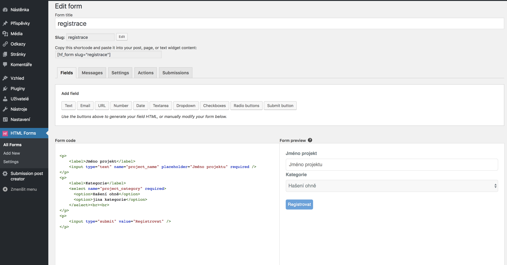
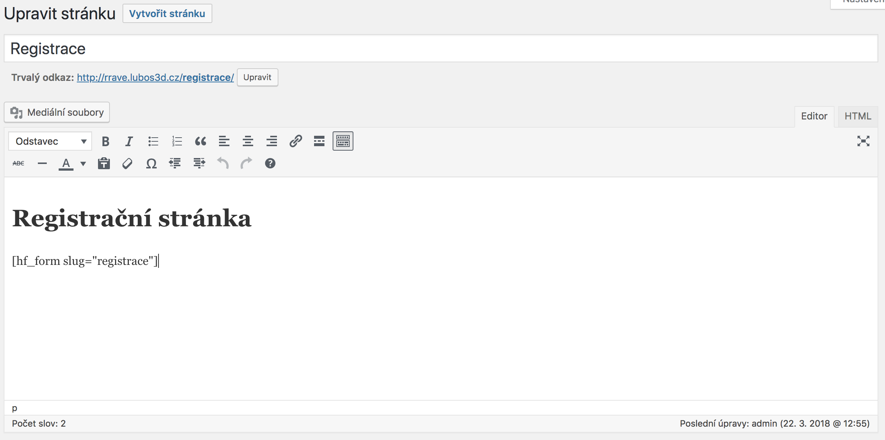
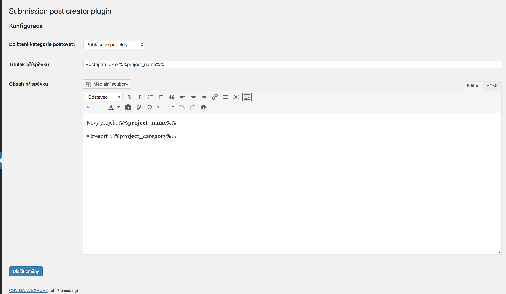

# submission-post-creator

how to use?

**install plugin HTML FORMS**

https://wordpress.org/plugins/html-forms/

**create custom form**

**place created tag on page you want**

**place folder called "submission-post-creator" from github to yours plugin folder**

/wp-content/plugins/

**enable that plugin in administration**

**use configuration of your choce, for example:**

